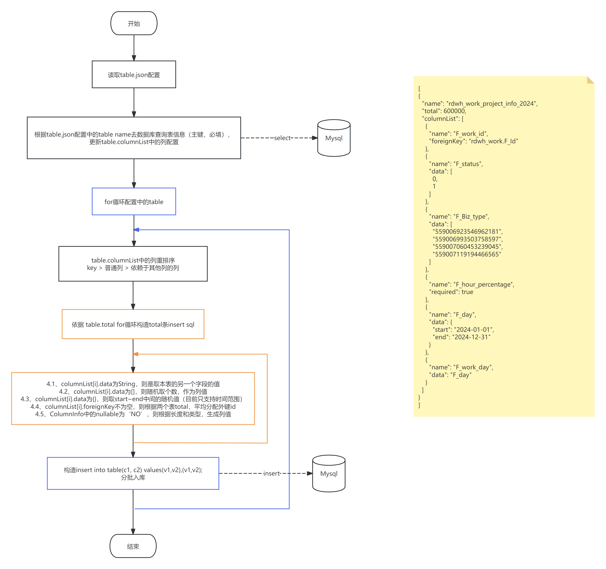

# 简介

dbmock是用来模拟mysql数据的小工具。接口压测的时候，我们需要生成大量的数据，耗时耗力，dbmock可以通过简单的配置，批量生成表数据，包括关联表的数据。

## 代码仓库

https://gitee.com/mamba_tools/dbmock.git

## 代码说明

- jdk 1.8+

- hutool 5.8.10

- fastjson 1.2.60

  

# 配置说明

## 数据库连接配置

数据库操作使用hutool-db的，详情参看https://doc.hutool.cn/pages/db/index/

## mock表信息配置

resources下新建**table.json**

| 配置名     | 子配置     | 配置类型       | 配置说明                | 示例                                          |
| ---------- | ---------- | -------------- | ----------------------- | --------------------------------------------- |
| name       |            | string         | 表名                    |                                               |
| total      |            | int            | mock表行数              |                                               |
| columnList |            | []             | 列配置                  |                                               |
|            | name       | string         | 列名                    |                                               |
|            | required   | bool           | 是否必填；              | true\|false                                   |
|            | foreignKey | string         | 表外键，格式：表名.列名 | "organ.id"                                    |
|            | data       | 多种类型，如下 |                         |                                               |
|            |            | string         | 使用本表的另外一个字段  | "nickname"                                    |
|            |            | []             | 数组中随机取值          | [0,1,2]                                       |
|            |            | {}             | 时间范围                | {"start": "2024-01-01",  "end": "2024-12-31"} |

配置示例：

```json
[
  {
    "name": "rdwh_work_project_info_2024",
    "total": 600000,
    "columnList": [
      {
        "name": "F_work_id",
        "foreignKey": "rdwh_work.F_Id"
      },
      {
        "name": "F_status",
        "data": [
          0,
          1
        ]
      },
      {
        "name": "F_Biz_type",
        "data": [
          "559006923546962181",
          "559006993503758597",
          "559007060453239045",
          "559007119194466565"
        ]
      },
      {
        "name": "F_hour_percentage",
        "required": true
      },
      {
        "name": "F_day",
        "data": {
          "start": "2024-01-01",
          "end": "2024-12-31"
        }
      },
      {
        "name": "F_work_day",
        "data": "F_day"
      } 
    ]
  }
]
```

## 应用配置

resources下新建**application.properties**

| 配置名           | 配置类型 | 配置说明                           | 示例        |
| ---------------- | -------- | ---------------------------------- | ----------- |
| dbmock.idType    | string   | insert主键生成类型                 | String\|int |
| dbmock.batchSize | int      | 批量insert大小，每1000条insert一次 | 1000        |
| dbmock.tableFile | string   | mock表信息配置的json文件           | table.json  |

# 使用说明

调用**DBMock.mock()**即可

注意：数据库连接用户需要有**SHOW FULL COLUMNS FROM xxx**权限

